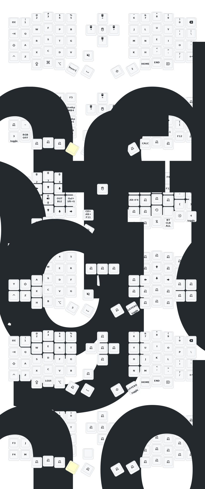

Editor: https://nickcoutsos.github.io/keymap-editor/

Change keymap by hitting reset button twice, then drop the eyelash left or nice view right into the nice nano folder. 
Then re-pair the two halves by hitting the reset buttons at the same time.

# Sofle Keymap

